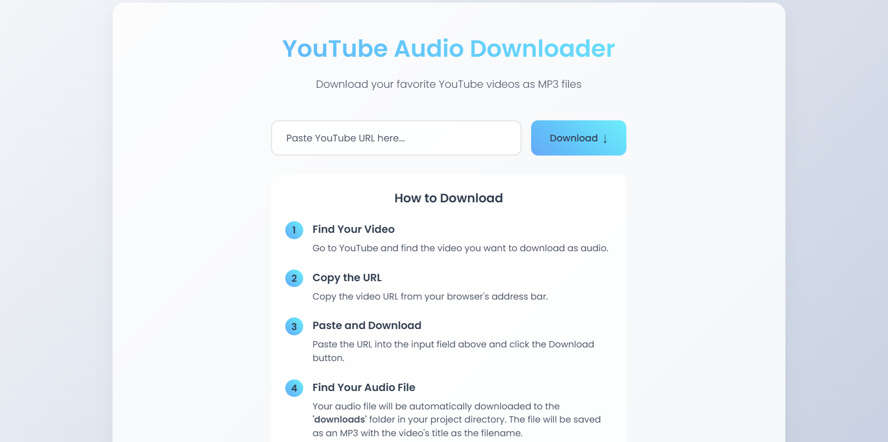

# YouTube Audio Downloader

A simple and elegant web application that allows you to download audio from YouTube videos as MP3 files. Built with Flask and yt-dlp.



## Features

- 🎵 Download YouTube videos as MP3 files
- 🌓 Dark/Light mode support
- 🎨 Modern and responsive UI
- ⚡ Fast and efficient downloads
- 📁 Automatic file organization

## Prerequisites

- Python 3.7 or higher
- pip (Python package installer)

## Installation

1. Clone the repository:
```bash
git clone https://github.com/yourusername/youtube-audio-downloader.git
cd youtube-audio-downloader
```

2. Create a virtual environment (recommended):
```bash
python -m venv venv
source venv/bin/activate  # On Windows: venv\Scripts\activate
```

3. Install the required packages:
```bash
pip install -r requirements.txt
```

## Usage

1. Start the application:
```bash
python app.py
```

2. Open your web browser and navigate to:
```
http://localhost:5000
```

3. To download audio:
   - Copy a YouTube video URL
   - Paste it into the input field
   - Click the Download button
   - Your MP3 file will be saved in the `downloads` folder

## File Location

- Downloaded files are saved in the `downloads` folder within your project directory
- Files are automatically named after the video title
- Special characters in filenames are automatically cleaned

## Project Structure

```
youtube-audio-downloader/
├── app.py              # Main application file
├── requirements.txt    # Python dependencies
├── downloads/          # Downloaded audio files
└── templates/
    ├── index.html     # Main page template
    └── style.css      # Styling
```

## Dependencies

- Flask: Web framework
- yt-dlp: YouTube video downloader
- FFmpeg: Audio processing

## Contributing

Contributions are welcome! Please feel free to submit a Pull Request.

## License

This project is licensed under the MIT License - see the LICENSE file for details.

## Acknowledgments

- [yt-dlp](https://github.com/yt-dlp/yt-dlp) for the YouTube download functionality
- [Flask](https://flask.palletsprojects.com/) for the web framework
- [Font Awesome](https://fontawesome.com/) for icons 